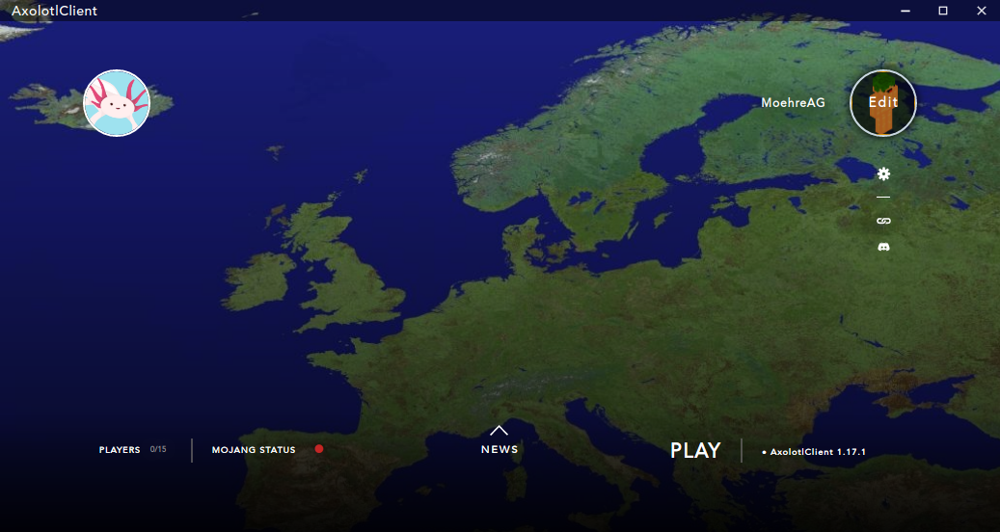

<h1 align="center">AxolotlClient</h1>

<em><h5 align="center">(fork of HeliosLauncher, formerly known as Electron Launcher)</h5></em>
[
](https://github.com/moehreag/AxolotlClient/releases)

Join servers without worrying about installing Java, Fabric, or other mods. We'll handle that for you.

<!---->

## Features

* 🔒 Full account management.
  * Add multiple accounts and easily switch between them.
  * Credentials are never stored and transmitted directly to Mojang.
* 📂 Efficient asset management.
  * Receive client updates as soon as we release them.
  * Files are validated before launch. Corrupt or incorrect files will be redownloaded.
* ☕ **Automatic Java validation.**
  * If you have an incompatible version of Java installed, we'll install the right one *for you*.
  * You do not need to have Java installed to run the launcher.
* 📰 News feed natively built into the launcher. (COMING SOON)
* ⚙️ Intuitive settings management, including a Java control panel.
* Supports all of our versions.
  * Switch between version configurations with ease.
  * View the player count of our server.
* Automatic updates. That's right, the launcher updates itself.
*  View the status of Mojang's services.

This is not an exhaustive list. Download and install the launcher to gauge all it can do!

#### Need Help? 

 * Contact us on Discord
 * Report an [Issue][issue]

#### Like the project? Leave a ⭐ star on the repository!

## Downloads

You can download from [GitHub Releases](https://github.com/moehreag/AxolotlClient/releases)

#### Latest Release

#### Latest Pre-Release

**Supported Platforms**

If you download from the [Releases](https://github.com/moehreag/AxolotlClient/releases) tab, select the installer for your system.

| Platform | File |
| -------- | ---- |
| Windows x64 | `AxolotlClient-VERSION.exe` |
| Linux x64 | `AxolotlClient-VERSION.AppImage` |
| MacOS x64 | `AxolotlClient-VERSION.dmg`|
| MacOS arm64 | `AxolotlClient-VERSION-arm64.dmg`|

### Credits

This is a fork of __HeliosLauncher__ by _dscalzi_ and _Aventium Softworks_. Please honour their work by joining their discord.

[][discord]

# Other People

RasenRamen: Had the Idea for the name

kuchenag: Made the nice images

---

The best way to contact the developers (me) is on Discord.

[][discord2]

---

### See you ingame.

[discord]: https://discord.gg/zNWUXdt 'Discord'
[discord2]: https://discord.gg/9Q3brQVQZN 'Discord'
[issue]: https://github.com/moehreag/AxolotlClient/issues
